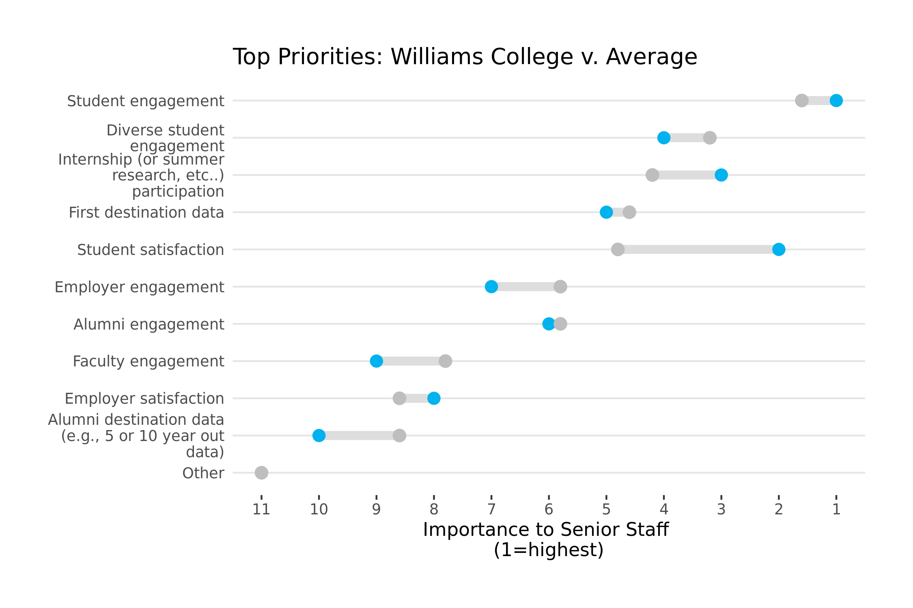

LACN 2022 Survey
================

This document walks you through the structure, purpose, and output of
this repository. All scripts can be found in the **code** directory.

# File Structure

    ## Contents of lacn directory

    ## [1] "code"       "data"       "lacn.RData" "lacn.Rproj" "output"    
    ## [6] "README.md"  "README.Rmd"

    ## 
    ## Files in code subdirectory

    ## [1] "1_read_data.R" "2_clean.R"     "3_functions.R" "4_analysis.R" 
    ## [5] "5_viz.R"

    ## 
    ## Files in data subdirectory

    ## [1] "lacn_2022.csv"    "response_key.csv"

# Load Data

Script: **1\_read\_data.R**

The raw survey data (“lacn\_2022.csv”) resides in the data subdirectory
of the lacn folder. The first several lines of this script load this
data and remove several redundant rows.

Next, we specify the Gooogle Sheets spreadsheet we want to connect with
(this will come in handy a bit later).

The next task is creating a reference lookup table for all the
questions, their descriptions, and response descriptions. We will call
this our “Response Key.” First we create a somewhat messy version from
the raw data (**response\_key\_messy**). Then we send it over to Sheets
for some manual cleaning before bringing it back into R, now calling it
**response\_key**. This will be crucial for maintaining consistent
references throughout analysis and visualization.

    ## Reference Lookup Table:

    ##   Question main sub1 sub2
    ## 1     Q1_1   Q1    1 <NA>
    ## 2     Q1_2   Q1    2 <NA>
    ## 3       Q2   Q2 <NA> <NA>
    ##                                                                                            Description
    ## 1 On behalf of the LACN Benchmarking Committee, thank you for taking the time to complete this requ...
    ## 2 On behalf of the LACN Benchmarking Committee, thank you for taking the time to complete this requ...
    ## 3                                                                               To whom do you report?
    ##        Description_short                                  dim1 dim2
    ## 1                   <NA> Name of person completing this survey <NA>
    ## 2                   <NA>                           Institution <NA>
    ## 3 To whom do you report?                       Selected Choice <NA>

Our final task in this initial section is creating a table of question
types. Some LACN questions are single-response, some are multi-choice
(more than one can be selected), some allow for a matrix of responses
per college, some a continuous numeric input, and one a ordinal ranking.
If we want to automate the cleaning and analysis of the survey
questions, we need to be able to separate out the single-response
questions from the matrix questions, etc. The **question\_type**
dataframe, built manually in Google Sheets and then imported into R.

Now we can move to analyzing each question on its own terms.

# Cleaning

Script: **2\_clean.R**

One of the challenges with this data is how *wide* it is. The raw survey
dataframe contains 257 variables. If we want to speed up our analysis,
we need to break the dataset up by question. That way, when we want to
analyze Q8, we can simply handle the Q8 dataset without having to sift
through the entire 257-column raw dataset.

**clean.R** loops through each question and extracts its columns from
the master dataset, along with the name of each respondent and their
size category, following Lauren’s style last year. We then deposit each
of those question-specific dataframes (specified as
**current\_question** in the for loop) into a “list,” which is an object
capable of containing other objects (like dataframes) within it. Now, we
have a nice portable object we can manipulation, explore, and use in
later analysis. Without this list, we would have to repeat ourselves
every time we wanted to extract a single question and analyze it.

Below is a representation of the structure of that list (called
**question\_list**). As you can see, **question\_list**, represented by
the top-most black rectangle, contains within it

    ## █ [1:0x557bb90f1260] <named list> 
    ## ├─Q1 = █ [2:0x557bb9bd09d8] <tbl_df[,4]> 
    ## │      ├─Institution Name = [3:0x557bb9bc0e98] <chr> 
    ## │      ├─Institution size category = [4:0x557bb9bc0e28] <chr> 
    ## │      ├─Q1_1 = [5:0x557bb9bc0db8] <chr> 
    ## │      └─Q1_2 = [6:0x557bb9bc0d48] <chr> 
    ## ├─Q2 = █ [7:0x557bb9bd0668] <tbl_df[,4]> 
    ## │      ├─Institution Name = [8:0x557bb9bc0cd8] <chr> 
    ## │      ├─Institution size category = [9:0x557bb9bc0c68] <chr> 
    ## │      ├─Q2 = [10:0x557bb9bc0bf8] <chr> 
    ## │      └─Q2_6_TEXT = [11:0x557bb9bc0b88] <chr> 
    ## ├─Q3 = █ [12:0x557bb9bd04d8] <tbl_df[,3]> 
    ## │      ├─Institution Name = [13:0x557bb9bc0b18] <chr> 
    ## │      ├─Institution size category = [14:0x557bb9bc0aa8] <chr> 
    ## │      └─Q3 = [15:0x557bb9bc0a38] <chr> 
    ## ├─Q4 = █ [16:0x557bb9bdfe08] <tbl_df[,11]> 
    ## │      ├─Institution Name = [17:0x557bb9bc09c8] <chr> 
    ## │      ├─Institution size category = [18:0x557bb9bc0958] <chr> 
    ## │      ├─Q4_3 = [19:0x557bb9bc08e8] <chr> 
    ## │      ├─Q4_4 = [20:0x557bb9bc0878] <chr> 
    ## │      ├─Q4_5 = [21:0x557bb9bc0808] <chr> 
    ## │      ├─Q4_6 = [22:0x557bb9bc0798] <chr> 
    ## │      ├─Q4_7 = [23:0x557bb9bc0728] <chr> 
    ## │      ├─Q4_8 = [24:0x557bb9bc06b8] <chr> 
    ## │      ├─Q4_9 = [25:0x557bb9bc0648] <chr> 
    ## │      ├─Q4_10 = [26:0x557bb9bc05d8] <chr> 
    ## │      └─Q4_9_TEXT = [27:0x557bb9bc0568] <chr> 
    ## ├─Q5 = █ [28:0x557bb9bdfca8] <tbl_df[,14]> 
    ## │      ├─Institution Name = [29:0x557bb9bc04f8] <chr> 
    ## │      ├─Institution size category = [30:0x557bb9bc0488] <chr> 
    ## │      ├─Q5_6 = [31:0x557bb9bc0418] <chr> 
    ## │      ├─Q5_7 = [32:0x557bb9bc03a8] <chr> 
    ## │      ├─Q5_8 = [33:0x557bb9bc0338] <chr> 
    ## │      ├─Q5_9 = [34:0x557bb9bc02c8] <chr> 
    ## │      ├─Q5_10 = [35:0x557bb9bc0258] <chr> 
    ## │      ├─Q5_15 = [36:0x557bb9bc01e8] <chr> 
    ## │      ├─Q5_1 = [37:0x557bb9bc0178] <chr> 
    ## │      ├─Q5_16 = [38:0x557bb9bc0108] <chr> 
    ## │      ├─Q5_11 = [39:0x557bb9bc0098] <chr> 
    ## │      ├─Q5_12 = [40:0x557bb9be4438] <chr> 
    ## │      ├─Q5_13 = [41:0x557bb9be43c8] <chr> 
    ## │      └─Q5_13_TEXT = [42:0x557bb9be4358] <chr> 
    ## ├─Q6 = █ [43:0x557bb9be42e8] <tbl_df[,8]> 
    ## │      ├─Institution Name = [44:0x557bb9be4278] <chr> 
    ## │      ├─Institution size category = [45:0x557bb9be4208] <chr> 
    ## │      ├─Q6_1_1 = [46:0x557bb9be4198] <chr> 
    ## │      ├─Q6_1_2 = [47:0x557bb9be4128] <chr> 
    ## │      ├─Q6_2_1 = [48:0x557bb9be40b8] <chr> 
    ## │      ├─Q6_2_2 = [49:0x557bb9be4048] <chr> 
    ## │      ├─Q6_3_1 = [50:0x557bb9be3fd8] <chr> 
    ## │      └─Q6_3_2 = [51:0x557bb9be3f68] <chr> 
    ## ├─Q7 = █ [52:0x557bb9be3e88] <tbl_df[,8]> 
    ## │      ├─Institution Name = [53:0x557bb9be3e18] <chr> 
    ## │      ├─Institution size category = [54:0x557bb9be3da8] <chr> 
    ## │      ├─Q7_1_9 = [55:0x557bb9be3d38] <chr> 
    ## │      ├─Q7_1_2 = [56:0x557bb9be3cc8] <chr> 
    ## │      ├─Q7_1_3 = [57:0x557bb9be3c58] <chr> 
    ## │      ├─Q7_1_4 = [58:0x557bb9be3be8] <chr> 
    ## │      ├─Q7_1_5 = [59:0x557bb9be3b78] <chr> 
    ## │      └─Q7_1_10 = [60:0x557bb9be3b08] <chr> 
    ## ├─Q8 = █ [61:0x557bb90f1360] <tbl_df[,44]> 
    ## │      ├─Institution Name = [62:0x557bb9be3a28] <chr> 
    ## │      ├─Institution size category = [63:0x557bb9be39b8] <chr> 
    ## │      ├─Q8_1_1 = [64:0x557bb9be3948] <chr> 
    ## │      ├─Q8_1_2 = [65:0x557bb9be38d8] <chr> 
    ## │      ├─Q8_1_3 = [66:0x557bb9be3868] <chr> 
    ## │      ├─Q8_2_1 = [67:0x557bb9be37f8] <chr> 
    ## │      ├─Q8_2_2 = [68:0x557bb9be3788] <chr> 
    ## │      ├─Q8_2_3 = [69:0x557bb9be3718] <chr> 
    ## │      ├─Q8_3_1 = [70:0x557bb9be36a8] <chr> 
    ## │      ├─Q8_3_2 = [71:0x557bb9be3638] <chr> 
    ## │      ├─Q8_3_3 = [72:0x557bb9be35c8] <chr> 
    ## │      ├─Q8_4_1 = [73:0x557bb9be3558] <chr> 
    ## │      ├─Q8_4_2 = [74:0x557bb9be34e8] <chr> 
    ## │      ├─Q8_4_3 = [75:0x557bb9be3478] <chr> 
    ## │      ├─Q8_5_1 = [76:0x557bb9be3408] <chr> 
    ## │      ├─Q8_5_2 = [77:0x557bb9be3398] <chr> 
    ## │      ├─Q8_5_3 = [78:0x557bb9be3328] <chr> 
    ## │      ├─Q8_6_1 = [79:0x557bb9be32b8] <chr> 
    ## │      ├─Q8_6_2 = [80:0x557bb9be3248] <chr> 
    ## │      ├─Q8_6_3 = [81:0x557bb9be31d8] <chr> 
    ## │      ├─Q8_7_1 = [82:0x557bb9be3168] <chr> 
    ## │      ├─Q8_7_2 = [83:0x557bb9be30f8] <chr> 
    ## │      ├─Q8_7_3 = [84:0x557bb9be3088] <chr> 
    ## │      ├─Q8_8_1 = [85:0x557bb9be3018] <chr> 
    ## │      ├─Q8_8_2 = [86:0x557bb9be2fa8] <chr> 
    ## │      ├─Q8_8_3 = [87:0x557bb9be2f38] <chr> 
    ## │      ├─Q8_9_1 = [88:0x557bb9be2ec8] <chr> 
    ## │      ├─Q8_9_2 = [89:0x557bb9be2e58] <chr> 
    ## │      ├─Q8_9_3 = [90:0x557bb9be2de8] <chr> 
    ## │      ├─Q8_10_1 = [91:0x557bb9be2d78] <chr> 
    ## │      ├─Q8_10_2 = [92:0x557bb9be2d08] <chr> 
    ## │      ├─Q8_10_3 = [93:0x557bb9be2c98] <chr> 
    ## │      ├─Q8_11_1 = [94:0x557bb9be2c28] <chr> 
    ## │      ├─Q8_11_2 = [95:0x557bb9be2bb8] <chr> 
    ## │      ├─Q8_11_3 = [96:0x557bb9be2b48] <chr> 
    ## │      ├─Q8_12_1 = [97:0x557bb9be2ad8] <chr> 
    ## │      ├─Q8_12_2 = [98:0x557bb9be2a68] <chr> 
    ## │      ├─Q8_12_3 = [99:0x557bb9be29f8] <chr> 
    ## │      ├─Q8_13_1 = [100:0x557bb9be2988] <chr> 
    ## │      ├─Q8_13_2 = [101:0x557bb9be2918] <chr> 
    ## │      ├─Q8_13_3 = [102:0x557bb9be28a8] <chr> 
    ## │      ├─Q8_14_1 = [103:0x557bb9be2838] <chr> 
    ## │      ├─Q8_14_2 = [104:0x557bb9be27c8] <chr> 
    ## │      └─Q8_14_3 = [105:0x557bb9be2758] <chr> 
    ## ├─Q9 = █ [106:0x557bb9bdfb48] <tbl_df[,14]> 
    ## │      ├─Institution Name = [107:0x557bb9be26e8] <chr> 
    ## │      ├─Institution size category = [108:0x557bb9be2678] <chr> 
    ## │      ├─Q9_1 = [109:0x557bb9be2608] <chr> 
    ## │      ├─Q9_2 = [110:0x557bb9be2598] <chr> 
    ## │      ├─Q9_3 = [111:0x557bb9be6358] <chr> 
    ## │      ├─Q9_4 = [112:0x557bb9be62e8] <chr> 
    ## │      ├─Q9_5 = [113:0x557bb9be6278] <chr> 
    ## │      ├─Q9_6 = [114:0x557bb9be6208] <chr> 
    ## │      ├─Q9_7 = [115:0x557bb9be6198] <chr> 
    ## │      ├─Q9_8 = [116:0x557bb9be6128] <chr> 
    ## │      ├─Q9_9 = [117:0x557bb9be60b8] <chr> 
    ## │      ├─Q9_10 = [118:0x557bb9be6048] <chr> 
    ## │      ├─Q9_11 = [119:0x557bb9be5fd8] <chr> 
    ## │      └─Q9_11_TEXT = [120:0x557bb9be5f68] <chr> 
    ## ├─Q10 = █ [121:0x557bb9bdf9e8] <tbl_df[,14]> 
    ## │       ├─Institution Name = [122:0x557bb9be5ef8] <chr> 
    ## │       ├─Institution size category = [123:0x557bb9be5e88] <chr> 
    ## │       ├─Q10_1 = [124:0x557bb9be5e18] <chr> 
    ## │       ├─Q10_3 = [125:0x557bb9be5da8] <chr> 
    ## │       ├─Q10_4 = [126:0x557bb9be5d38] <chr> 
    ## │       ├─Q10_5 = [127:0x557bb9be5cc8] <chr> 
    ## │       ├─Q10_6 = [128:0x557bb9be5c58] <chr> 
    ## │       ├─Q10_7 = [129:0x557bb9be5be8] <chr> 
    ## │       ├─Q10_8 = [130:0x557bb9be5b78] <chr> 
    ## │       ├─Q10_10 = [131:0x557bb9be5b08] <chr> 
    ## │       ├─Q10_11 = [132:0x557bb9be5a98] <chr> 
    ## │       ├─Q10_12 = [133:0x557bb9be5a28] <chr> 
    ## │       ├─Q10_13 = [134:0x557bb9be59b8] <chr> 
    ## │       └─Q10_13_TEXT = [135:0x557bb9be5948] <chr> 
    ## ├─Q11 = █ [136:0x557bb7401870] <tbl_df[,26]> 
    ## │       ├─Institution Name = [137:0x557bb9be58d8] <chr> 
    ## │       ├─Institution size category = [138:0x557bb9be5868] <chr> 
    ## │       ├─Q11_27 = [139:0x557bb9be57f8] <chr> 
    ## │       ├─Q11_1 = [140:0x557bb9be5788] <chr> 
    ## │       ├─Q11_2 = [141:0x557bb9be5718] <chr> 
    ## │       ├─Q11_4 = [142:0x557bb9be56a8] <chr> 
    ## │       ├─Q11_5 = [143:0x557bb9be5638] <chr> 
    ## │       ├─Q11_6 = [144:0x557bb9be55c8] <chr> 
    ## │       ├─Q11_16 = [145:0x557bb9be5558] <chr> 
    ## │       ├─Q11_11 = [146:0x557bb9be54e8] <chr> 
    ## │       ├─Q11_12 = [147:0x557bb9be5478] <chr> 
    ## │       ├─Q11_7 = [148:0x557bb9be5408] <chr> 
    ## │       ├─Q11_3 = [149:0x557bb9be5398] <chr> 
    ## │       ├─Q11_32 = [150:0x557bb9be5328] <chr> 
    ## │       ├─Q11_33 = [151:0x557bb9be52b8] <chr> 
    ## │       ├─Q11_34 = [152:0x557bb9be5248] <chr> 
    ## │       ├─Q11_31 = [153:0x557bb9be51d8] <chr> 
    ## │       ├─Q11_13 = [154:0x557bb9be5168] <chr> 
    ## │       ├─Q11_14 = [155:0x557bb9be50f8] <chr> 
    ## │       ├─Q11_8 = [156:0x557bb9be5088] <chr> 
    ## │       ├─Q11_28 = [157:0x557bb9be5018] <chr> 
    ## │       ├─Q11_9 = [158:0x557bb9be4fa8] <chr> 
    ## │       ├─Q11_10 = [159:0x557bb9be4f38] <chr> 
    ## │       ├─Q11_15 = [160:0x557bb9be4ec8] <chr> 
    ## │       ├─Q11_29 = [161:0x557bb9be4e58] <chr> 
    ## │       └─Q11_29_TEXT = [162:0x557bb9be4de8] <chr> 
    ## ├─Q12 = █ [163:0x557bb9bd0168] <tbl_df[,3]> 
    ## │       ├─Institution Name = [164:0x557bb9be4d78] <chr> 
    ## │       ├─Institution size category = [165:0x557bb9be4d08] <chr> 
    ## │       └─Q12 = [166:0x557bb9be4c98] <chr> 
    ## ├─Q13 = █ [167:0x557bb9be4c28] <tbl_df[,7]> 
    ## │       ├─Institution Name = [168:0x557bb9be4bb8] <chr> 
    ## │       ├─Institution size category = [169:0x557bb9be4b48] <chr> 
    ## │       ├─Q13_1 = [170:0x557bb9be4ad8] <chr> 
    ## │       ├─Q13_2 = [171:0x557bb9be4a68] <chr> 
    ## │       ├─Q13_3 = [172:0x557bb9be49f8] <chr> 
    ## │       ├─Q13_4 = [173:0x557bb9be4988] <chr> 
    ## │       └─Q13_4_TEXT = [174:0x557bb9be4918] <chr> 
    ## ├─Q14 = █ [175:0x557bb9bd0028] <tbl_df[,3]> 
    ## │       ├─Institution Name = [176:0x557bb9be4838] <chr> 
    ## │       ├─Institution size category = [177:0x557bb9be47c8] <chr> 
    ## │       └─Q14 = [178:0x557bb9be4758] <chr> 
    ## ├─Q15 = █ [179:0x557bb9bcff38] <tbl_df[,3]> 
    ## │       ├─Institution Name = [180:0x557bb9be46e8] <chr> 
    ## │       ├─Institution size category = [181:0x557bb9be4678] <chr> 
    ## │       └─Q15 = [182:0x557bb9be4608] <chr> 
    ## ├─Q16 = █ [183:0x557bb9bcfd58] <tbl_df[,4]> 
    ## │       ├─Institution Name = [184:0x557bb9be4528] <chr> 
    ## │       ├─Institution size category = [185:0x557bb9be44b8] <chr> 
    ## │       ├─Q16 = [186:0x557bb9be8278] <chr> 
    ## │       └─Q16_2_TEXT = [187:0x557bb9be8208] <chr> 
    ## ├─Q36 = █ [188:0x557bb9bdf888] <tbl_df[,14]> 
    ## │       ├─Institution Name = [189:0x557bb9be8198] <chr> 
    ## │       ├─Institution size category = [190:0x557bb9be8128] <chr> 
    ## │       ├─Q36_1_1 = [191:0x557bb9be80b8] <chr> 
    ## │       ├─Q36_1_2 = [192:0x557bb9be8048] <chr> 
    ## │       ├─Q36_2_1 = [193:0x557bb9be7fd8] <chr> 
    ## │       ├─Q36_2_2 = [194:0x557bb9be7f68] <chr> 
    ## │       ├─Q36_3_1 = [195:0x557bb9be7ef8] <chr> 
    ## │       ├─Q36_3_2 = [196:0x557bb9be7e88] <chr> 
    ## │       ├─Q36_4_1 = [197:0x557bb9be7e18] <chr> 
    ## │       ├─Q36_4_2 = [198:0x557bb9be7da8] <chr> 
    ## │       ├─Q36_5_1 = [199:0x557bb9be7d38] <chr> 
    ## │       ├─Q36_5_2 = [200:0x557bb9be7cc8] <chr> 
    ## │       ├─Q36_6_1 = [201:0x557bb9be7c58] <chr> 
    ## │       └─Q36_6_2 = [202:0x557bb9be7be8] <chr> 
    ## ├─Q37 = █ [203:0x557bb9bdf728] <tbl_df[,10]> 
    ## │       ├─Institution Name = [204:0x557bb9be7b78] <chr> 
    ## │       ├─Institution size category = [205:0x557bb9be7b08] <chr> 
    ## │       ├─Q37_1_1 = [206:0x557bb9be7a98] <chr> 
    ## │       ├─Q37_1_2 = [207:0x557bb9be7a28] <chr> 
    ## │       ├─Q37_2_1 = [208:0x557bb9be79b8] <chr> 
    ## │       ├─Q37_2_2 = [209:0x557bb9be7948] <chr> 
    ## │       ├─Q37_3_1 = [210:0x557bb9be78d8] <chr> 
    ## │       ├─Q37_3_2 = [211:0x557bb9be7868] <chr> 
    ## │       ├─Q37_4_1 = [212:0x557bb9be77f8] <chr> 
    ## │       └─Q37_4_2 = [213:0x557bb9be7788] <chr> 
    ## ├─Q19 = █ [214:0x557bb9be7718] <tbl_df[,6]> 
    ## │       ├─Institution Name = [215:0x557bb9be76a8] <chr> 
    ## │       ├─Institution size category = [216:0x557bb9be7638] <chr> 
    ## │       ├─Q19_1 = [217:0x557bb9be75c8] <chr> 
    ## │       ├─Q19_2 = [218:0x557bb9be7558] <chr> 
    ## │       ├─Q19_3 = [219:0x557bb9be74e8] <chr> 
    ## │       └─Q19_4 = [220:0x557bb9be7478] <chr> 
    ## ├─Q20 = █ [221:0x557bb9bdf5c8] <tbl_df[,14]> 
    ## │       ├─Institution Name = [222:0x557bb9be7398] <chr> 
    ## │       ├─Institution size category = [223:0x557bb9be7328] <chr> 
    ## │       ├─Q20_1_1 = [224:0x557bb9be72b8] <chr> 
    ## │       ├─Q20_1_2 = [225:0x557bb9be7248] <chr> 
    ## │       ├─Q20_2_1 = [226:0x557bb9be71d8] <chr> 
    ## │       ├─Q20_2_2 = [227:0x557bb9be7168] <chr> 
    ## │       ├─Q20_3_1 = [228:0x557bb9be70f8] <chr> 
    ## │       ├─Q20_3_2 = [229:0x557bb9be7088] <chr> 
    ## │       ├─Q20_4_1 = [230:0x557bb9be7018] <chr> 
    ## │       ├─Q20_4_2 = [231:0x557bb9be6fa8] <chr> 
    ## │       ├─Q20_5_1 = [232:0x557bb9be6f38] <chr> 
    ## │       ├─Q20_5_2 = [233:0x557bb9be6ec8] <chr> 
    ## │       ├─Q20_6_1 = [234:0x557bb9be6e58] <chr> 
    ## │       └─Q20_6_2 = [235:0x557bb9be6de8] <chr> 
    ## ├─Q21 = █ [236:0x557bb90f17b0] <tbl_df[,22]> 
    ## │       ├─Institution Name = [237:0x557bb9be6d78] <chr> 
    ## │       ├─Institution size category = [238:0x557bb9be6d08] <chr> 
    ## │       ├─Q21_1_5 = [239:0x557bb9be6c98] <chr> 
    ## │       ├─Q21_1_2 = [240:0x557bb9be6c28] <chr> 
    ## │       ├─Q21_1_3 = [241:0x557bb9be6bb8] <chr> 
    ## │       ├─Q21_1_4 = [242:0x557bb9be6b48] <chr> 
    ## │       ├─Q21_2_5 = [243:0x557bb9be6ad8] <chr> 
    ## │       ├─Q21_2_2 = [244:0x557bb9be6a68] <chr> 
    ## │       ├─Q21_2_3 = [245:0x557bb9be69f8] <chr> 
    ## │       ├─Q21_2_4 = [246:0x557bb9be6988] <chr> 
    ## │       ├─Q21_3_5 = [247:0x557bb9be6918] <chr> 
    ## │       ├─Q21_3_2 = [248:0x557bb9be68a8] <chr> 
    ## │       ├─Q21_3_3 = [249:0x557bb9be6838] <chr> 
    ## │       ├─Q21_3_4 = [250:0x557bb9be67c8] <chr> 
    ## │       ├─Q21_4_5 = [251:0x557bb9be6758] <chr> 
    ## │       ├─Q21_4_2 = [252:0x557bb9be66e8] <chr> 
    ## │       ├─Q21_4_3 = [253:0x557bb9be6678] <chr> 
    ## │       ├─Q21_4_4 = [254:0x557bb9be6608] <chr> 
    ## │       ├─Q21_5_5 = [255:0x557bb9be6598] <chr> 
    ## │       ├─Q21_5_2 = [256:0x557bb9be6528] <chr> 
    ## │       ├─Q21_5_3 = [257:0x557bb9be64b8] <chr> 
    ## │       └─Q21_5_4 = [258:0x557bb9be6448] <chr> 
    ## ├─Q22 = █ [259:0x557bb9be63d8] <tbl_df[,8]> 
    ## │       ├─Institution Name = [260:0x557bb9bea198] <chr> 
    ## │       ├─Institution size category = [261:0x557bb9bea128] <chr> 
    ## │       ├─Q22_1_1 = [262:0x557bb9bea0b8] <chr> 
    ## │       ├─Q22_2_1 = [263:0x557bb9bea048] <chr> 
    ## │       ├─Q22_3_1 = [264:0x557bb9be9fd8] <chr> 
    ## │       ├─Q22_4_1 = [265:0x557bb9be9f68] <chr> 
    ## │       ├─Q22_5_1 = [266:0x557bb9be9ef8] <chr> 
    ## │       └─Q22_6_1 = [267:0x557bb9be9e88] <chr> 
    ## ├─Q23 = █ [268:0x557bb9be9da8] <tbl_df[,5]> 
    ## │       ├─Institution Name = [269:0x557bb9be9d38] <chr> 
    ## │       ├─Institution size category = [270:0x557bb9be9cc8] <chr> 
    ## │       ├─Q23_1 = [271:0x557bb9be9c58] <chr> 
    ## │       ├─Q23_4 = [272:0x557bb9be9be8] <chr> 
    ## │       └─Q23_2 = [273:0x557bb9be9b78] <chr> 
    ## ├─Q24 = █ [274:0x557bb9bdf468] <tbl_df[,11]> 
    ## │       ├─Institution Name = [275:0x557bb9be9a98] <chr> 
    ## │       ├─Institution size category = [276:0x557bb9be9a28] <chr> 
    ## │       ├─Q24_1_1 = [277:0x557bb9be99b8] <chr> 
    ## │       ├─Q24_1_2 = [278:0x557bb9be9948] <chr> 
    ## │       ├─Q24_1_5 = [279:0x557bb9be98d8] <chr> 
    ## │       ├─Q24_2_1 = [280:0x557bb9be9868] <chr> 
    ## │       ├─Q24_2_2 = [281:0x557bb9be97f8] <chr> 
    ## │       ├─Q24_2_5 = [282:0x557bb9be9788] <chr> 
    ## │       ├─Q24_3_1 = [283:0x557bb9be9718] <chr> 
    ## │       ├─Q24_3_2 = [284:0x557bb9be96a8] <chr> 
    ## │       └─Q24_3_5 = [285:0x557bb9be9638] <chr> 
    ## └─Q25 = █ [286:0x557bb9bcf9e8] <tbl_df[,3]> 
    ##         ├─Institution Name = [287:0x557bb9be95c8] <chr> 
    ##         ├─Institution size category = [288:0x557bb9be9558] <chr> 
    ##         └─Q25 = [289:0x557bb9be94e8] <chr>

# Functions for Analysis

Script: **3\_functions.R**

## Motivation

To get a sense for why the following custom functions are useful, let’s
inspect some of the raw data.

Below are several questions from the survey.

    ## Question 2

    ## # A data frame: 5 × 4
    ##   `Institution Name`            `Institution size category` Q2         Q2_6_TEXT
    ## * <chr>                         <chr>                       <chr>      <chr>    
    ## 1 Vassar College                2                           Student A… <NA>     
    ## 2 Williams College              2                           Other:     Office o…
    ## 3 Brandeis College              3                           Student A… <NA>     
    ## 4 College of the Holy Cross     2                           Academic … <NA>     
    ## 5 Franklin and Marshall College 2                           Student A… <NA>

    ## 
    ## Question 4

    ## # A data frame: 5 × 11
    ##   `Institution Name`  `Institution s…` Q4_3  Q4_4  Q4_5  Q4_6  Q4_7  Q4_8  Q4_9 
    ## * <chr>               <chr>            <chr> <chr> <chr> <chr> <chr> <chr> <chr>
    ## 1 Vassar College      2                <NA>  <NA>  <NA>  <NA>  <NA>  <NA>  <NA> 
    ## 2 Williams College    2                <NA>  Alum… <NA>  <NA>  <NA>  <NA>  <NA> 
    ## 3 Brandeis College    3                <NA>  <NA>  <NA>  <NA>  <NA>  <NA>  <NA> 
    ## 4 College of the Hol… 2                <NA>  <NA>  <NA>  <NA>  <NA>  <NA>  <NA> 
    ## 5 Franklin and Marsh… 2                <NA>  <NA>  <NA>  <NA>  <NA>  <NA>  <NA> 
    ## # … with 2 more variables: Q4_10 <chr>, Q4_9_TEXT <chr>

    ## 
    ## Question 5

    ## # A data frame: 5 × 14
    ##   `Institution Name`  `Institution s…` Q5_6  Q5_7  Q5_8  Q5_9  Q5_10 Q5_15 Q5_1 
    ## * <chr>               <chr>            <chr> <chr> <chr> <chr> <chr> <chr> <chr>
    ## 1 Vassar College      2                2     9     6     8     3     4     1    
    ## 2 Williams College    2                1     7     6     9     4     3     5    
    ## 3 Brandeis College    3                1     6     5     7     3     4     8    
    ## 4 College of the Hol… 2                2     3     9     7     1     4     8    
    ## 5 Franklin and Marsh… 2                2     4     3     8     5     6     1    
    ## # … with 5 more variables: Q5_16 <chr>, Q5_11 <chr>, Q5_12 <chr>, Q5_13 <chr>,
    ## #   Q5_13_TEXT <chr>

    ## 
    ## Question 6

    ## # A data frame: 5 × 8
    ##   `Institution Name`  `Institution s…` Q6_1_1 Q6_1_2 Q6_2_1 Q6_2_2 Q6_3_1 Q6_3_2
    ## * <chr>               <chr>            <chr>  <chr>  <chr>  <chr>  <chr>  <chr> 
    ## 1 Vassar College      2                5      0      4      0      0      0     
    ## 2 Williams College    2                8      0      16     0      0      0     
    ## 3 Brandeis College    3                6      0      3      1      0      0     
    ## 4 College of the Hol… 2                8      0      0      0      0      0     
    ## 5 Franklin and Marsh… 2                0      0      10     0      0      0

    ## 
    ## Question 7

    ## # A data frame: 5 × 8
    ##   `Institution Name` `Institution s…` Q7_1_9 Q7_1_2 Q7_1_3 Q7_1_4 Q7_1_5 Q7_1_10
    ## * <chr>              <chr>            <chr>  <chr>  <chr>  <chr>  <chr>  <chr>  
    ## 1 Vassar College     2                9      8      0      0      1      8.25   
    ## 2 Williams College   2                11     10     0      0      1      10     
    ## 3 Brandeis College   3                15     14     1      0      0      14.85  
    ## 4 College of the Ho… 2                11     8      0.83   0.5    0.42   9.75   
    ## 5 Franklin and Mars… 2                10     7      3      0      0      10

A brief inspection of these questions (and the original survey format)
reveals their widely varying structure. Question 2 allows for only one
response per participant, while Question 4 allows for multiple
responses. Question 5 requires each respondent to rank a list of items,
Question 6 provides a matrix for the respondent to fill in, and Question
7 asks for an unbounded numeric input reflecting the number of FTE
professional staff.

Here, we’re faced with a choice. First, we could analyze each of the 23
questions individually. While that is the most attractive option up
front, pursuing that path quickly presents a problem: we will end up
duplicating work when one question has the same form as an earlier one
and therefore can be analyzed using essentially the same method.
Questions 2 and 3, for example, are both single-response items. If we
analyzed them separately, we would probably just copy and paste the code
from Question 2 in order to work with Question 3.

Our second option, then, is to build some functions that can deal with
each of these question types efficiently. There are only five types:
single, multi, matrix, continuous, and ranking. That is a much more
manageable problem.

The challenge with this approach is building those functions. Custom
functions can be a bit intimidating at first, but what they lack in
simplicity they make up for in speed.

## Functions

Script: **3\_functions.R**

Note: the summarising method of the functions can be adjusted. Currently
they return averages when relevant, but we can change this to, for
example, sum with little difficulty.

### Helper Functions

In **lacn\_functions.R**, we find a handful of functions. First up are
two helper functions: *selectionFunction*, which returns a vector of
questions (e.g., c(“Q4”,“Q7”,“Q2”…)) that belong to a certain question
type, like “matrix”, and *keyFunction*, which returns a reference table
for response labels. Don’t worry too much about these; they just end up
getting wrapped into the main functions below.

### Analysis Functions

The four main types of question each get their own function (single,
multi, matrix, and continuous). *Ranking* does not, as there is only one
such question; building a function would be more trouble than it’s
worth. Without getting into too much detail, here’s how each of them
works

#### Single Function and Multi Function

Both of these merely group and aggregate the number of times each
response was selected, then add a variable for the relative frequency of
each response (with the denominator being the total number of
respondents).

    ## Original data:

    ## # A data frame: 5 × 4
    ##   `Institution Name`            `Institution size category` Q2         Q2_6_TEXT
    ## * <chr>                         <chr>                       <chr>      <chr>    
    ## 1 Vassar College                2                           Student A… <NA>     
    ## 2 Williams College              2                           Other:     Office o…
    ## 3 Brandeis College              3                           Student A… <NA>     
    ## 4 College of the Holy Cross     2                           Academic … <NA>     
    ## 5 Franklin and Marshall College 2                           Student A… <NA>

    ## 
    ## Aggregated data:

    ## # A data frame: 3 × 3
    ##   Q2                   n  freq
    ## * <chr>            <int> <dbl>
    ## 1 Academic Affairs     1   0.2
    ## 2 Other:               1   0.2
    ## 3 Student Affairs      3   0.6

#### Matrix Function

The matrix function pivots then unpivots each question so that the
matrix format of the original survey is recovered. It then summarises
the responses in each cell.

    ## Original data:

    ## # A data frame: 5 × 8
    ##   `Institution Name`  `Institution s…` Q6_1_1 Q6_1_2 Q6_2_1 Q6_2_2 Q6_3_1 Q6_3_2
    ## * <chr>               <chr>            <chr>  <chr>  <chr>  <chr>  <chr>  <chr> 
    ## 1 Vassar College      2                5      0      4      0      0      0     
    ## 2 Williams College    2                8      0      16     0      0      0     
    ## 3 Brandeis College    3                6      0      3      1      0      0     
    ## 4 College of the Hol… 2                8      0      0      0      0      0     
    ## 5 Franklin and Marsh… 2                0      0      10     0      0      0

    ## 
    ## Aggregated data:

    ##            dim2 Students in paraprofessional roles
    ## 1 Undergraduate                                5.4
    ## 2      Graduate                                0.0
    ##   Students in administrative roles
    ## 1                              6.6
    ## 2                              0.2
    ##   Students in "hybrid" roles (e.g., student workers have both paraprofessional and administrative duties)
    ## 1                                                                                                       0
    ## 2                                                                                                       0

#### Continuous Function

The continuous function pivots and aggregates data by response to return
some statistic on each response category.

    ## Original data:

    ## # A data frame: 5 × 8
    ##   `Institution Name` `Institution s…` Q7_1_9 Q7_1_2 Q7_1_3 Q7_1_4 Q7_1_5 Q7_1_10
    ## * <chr>              <chr>            <chr>  <chr>  <chr>  <chr>  <chr>  <chr>  
    ## 1 Vassar College     2                9      8      0      0      1      8.25   
    ## 2 Williams College   2                11     10     0      0      1      10     
    ## 3 Brandeis College   3                15     14     1      0      0      14.85  
    ## 4 College of the Ho… 2                11     8      0.83   0.5    0.42   9.75   
    ## 5 Franklin and Mars… 2                10     7      3      0      0      10

    ## 
    ## Aggregated data:

    ## # A data frame: 6 × 2
    ##   dim2                                                 mean
    ## * <chr>                                               <dbl>
    ## 1 # FT staff, academic year (or less than 12 months)  0.966
    ## 2 # FT staff, full year (12 months)                   9.4  
    ## 3 # PT Staff, academic year (or less than 12 months)  0.484
    ## 4 # PT staff, full year (12 months)                   0.1  
    ## 5 Total # of staff (headcount)                       11.2  
    ## 6 Total FTE                                          10.6

#### Ranking Analysis

The ranking question (Q5) doesn’t get its own function. Here’s how the
analysis works (see **analysis.R**). We simply compute the desired
statistic for the ranking of each “priority” (student engagment, first
destination data) and then pivot the resultant dataset in anticipation
of visualization.

#### Analyze Function

Finally, the analyze function allows us to do all of the above analysis
for each question type in just a few lines of code (see next section).

# Analysis

Script: **4\_analysis.R**

Next, we apply the functions we built to the original data we have
stored in **question\_list**. The analyzeFunction that we built above
allows us analyze any set of questions. That is, if we choose only the
“single” questions, it will apply the singleFunction to them.

The map function (see [purrr](https://purrr.tidyverse.org/) for more)
allows us to do exactly this. Let me explain the code below:

    ## all_questions:

    ## [1] "single"     "multi"      "matrix"     "continuous"

``` r
all_list <- map(all_questions,
                ~ analyzeFunction(
                  .x
                )
)
```

The first argument in the map function is the **all\_questions** vector.
The second argument is the function we want to apply to each element in
that vector (the ‘.x’ is just a placeholder to represent each element in
the vector). So first it will apply the singleFunction to the single
questions, then the multiFunction to the multi questions, and so on,
storing each question type separately in the list we’re calling
**all\_list**. After this code, the **analysis.R** script goes on to add
the ranking question into **all\_list** separately, as it did not have a
function.

## What did we create?

We now have a list containing the cleaned and summarised data for each
type of question (single, multi, matrix, continuous, ranking). See the
structure map below to get a sense of how the final data is stored. It
can look a bit chaotic at first, but the basic idea is this: the master
list contains different question types, which each contain the relevant
questions, which each contain the actual variables and data for each
summarised and aggregated response.

    ## █ [1:0x557bb9be9478] <named list> 
    ## ├─single = █ [2:0x557bb9be9408] <named list> 
    ## │          ├─Q2 = █ [3:0x557bb9bcf8f8] <tbl_df[,3]> 
    ## │          │      ├─Q2 = [4:0x557bb9bcf8a8] <chr> 
    ## │          │      ├─n = [5:0x557bb9be23f8] <int> 
    ## │          │      └─freq = [6:0x557bb9bcf858] <dbl> 
    ## │          ├─Q3 = █ [7:0x557bb9bcf768] <tbl_df[,3]> 
    ## │          │      ├─Q3 = [8:0x557bb9be23b8] <chr> 
    ## │          │      ├─n = [9:0x557bb8b095f0] <int> 
    ## │          │      └─freq = [10:0x557bb9be2378] <dbl> 
    ## │          ├─Q12 = █ [11:0x557bb9bcf678] <tbl_df[,3]> 
    ## │          │       ├─Q12 = [12:0x557bb9bcf628] <chr> 
    ## │          │       ├─n = [13:0x557bb9be2338] <int> 
    ## │          │       └─freq = [14:0x557bb9bcf5d8] <dbl> 
    ## │          ├─Q14 = █ [15:0x557bb9bcf4e8] <tbl_df[,3]> 
    ## │          │       ├─Q14 = [16:0x557bb8b09548] <chr> 
    ## │          │       ├─n = [17:0x557bb8b09510] <int> 
    ## │          │       └─freq = [18:0x557bb8b094d8] <dbl> 
    ## │          ├─Q16 = █ [19:0x557bb9bcf3f8] <tbl_df[,3]> 
    ## │          │       ├─Q16 = [20:0x557bb8b09468] <chr> 
    ## │          │       ├─n = [21:0x557bb8b09430] <int> 
    ## │          │       └─freq = [22:0x557bb8b093f8] <dbl> 
    ## │          └─Q25 = █ [23:0x557bb9bec018] <tbl_df[,3]> 
    ## │                  ├─Q25 = [24:0x557bb8b09388] <chr> 
    ## │                  ├─n = [25:0x557bb8b09350] <int> 
    ## │                  └─freq = [26:0x557bb8b09318] <dbl> 
    ## ├─multi = █ [27:0x557bb9be9328] <named list> 
    ## │         ├─Q4 = █ [28:0x557bb9bebf28] <tbl_df[,3]> 
    ## │         │      ├─value = [29:0x557bb9be22f8] <chr> 
    ## │         │      ├─n = [30:0x557bb8b092a8] <int> 
    ## │         │      └─freq = [31:0x557bb9be22b8] <dbl> 
    ## │         ├─Q9 = █ [32:0x557bb9bebe38] <tbl_df[,3]> 
    ## │         │      ├─value = [33:0x557bb9be92b8] <chr> 
    ## │         │      ├─n = [34:0x557bb9bebde8] <int> 
    ## │         │      └─freq = [35:0x557bb9be9248] <dbl> 
    ## │         ├─Q10 = █ [36:0x557bb9bebcf8] <tbl_df[,3]> 
    ## │         │       ├─value = [37:0x557bb9be91d8] <chr> 
    ## │         │       ├─n = [38:0x557bb9bebca8] <int> 
    ## │         │       └─freq = [39:0x557bb9be9168] <dbl> 
    ## │         ├─Q11 = █ [40:0x557bb9bebbb8] <tbl_df[,3]> 
    ## │         │       ├─value = [41:0x557bb90f1a90] <chr> 
    ## │         │       ├─n = [42:0x557bb9bdf308] <int> 
    ## │         │       └─freq = [43:0x557bb90f1b80] <dbl> 
    ## │         ├─Q13 = █ [44:0x557bb9bebac8] <tbl_df[,3]> 
    ## │         │       ├─value = [45:0x557bb9be2278] <chr> 
    ## │         │       ├─n = [46:0x557bb8b09190] <int> 
    ## │         │       └─freq = [47:0x557bb9be2238] <dbl> 
    ## │         └─Q15 = █ [48:0x557bb9beb9d8] <tbl_df[,3]> 
    ## │                 ├─value = [49:0x557bb9beb988] <chr> 
    ## │                 ├─n = [50:0x557bb9be21f8] <int> 
    ## │                 └─freq = [51:0x557bb9beb938] <dbl> 
    ## ├─matrix = █ [52:0x557bb9be9088] <named list> 
    ## │          ├─Q6 = █ [53:0x557bb9beb848] <df[,4]> 
    ## │          │      ├─dim2 = [54:0x557bb9be21b8] <chr> 
    ## │          │      ├─Students in paraprofessional roles = [55:0x557bb9be2178] <dbl> 
    ## │          │      ├─Students in administrative roles = [56:0x557bb9be2138] <dbl> 
    ## │          │      └─Students in "hybrid" roles (e.g., student workers have both paraprofessional and administrative duties) = [57:0x557bb9be20f8] <dbl> 
    ## │          ├─Q8 = █ [58:0x557bb9bdf258] <df[,15]> 
    ## │          │      ├─dim2 = [59:0x557bb9beb7a8] <chr> 
    ## │          │      ├─Student Counseling/Advising = [60:0x557bb9beb758] <dbl> 
    ## │          │      ├─Health Professions Advising = [61:0x557bb9beb708] <dbl> 
    ## │          │      ├─Alumni Counseling/Advising = [62:0x557bb9beb6b8] <dbl> 
    ## │          │      ├─Fellowship Advising = [63:0x557bb9beb668] <dbl> 
    ## │          │      ├─Pre-Law Advising = [64:0x557bb9beb618] <dbl> 
    ## │          │      ├─Program/Event Planning = [65:0x557bb9beb5c8] <dbl> 
    ## │          │      ├─Marketing/Communications = [66:0x557bb9beb578] <dbl> 
    ## │          │      ├─Employer Relations = [67:0x557bb9beb528] <dbl> 
    ## │          │      ├─Internship Funding = [68:0x557bb9beb4d8] <dbl> 
    ## │          │      ├─Office Management/Front Desk = [69:0x557bb9beb488] <dbl> 
    ## │          │      ├─Supervision of Professional Staff = [70:0x557bb9beb438] <dbl> 
    ## │          │      ├─Budget Management = [71:0x557bb9beb3e8] <dbl> 
    ## │          │      ├─Technology Management = [72:0x557bb9beb398] <dbl> 
    ## │          │      └─Assessment (Data, Outcomes, Program) = [73:0x557bb9beb348] <dbl> 
    ## │          ├─Q36 = █ [74:0x557bb9be9018] <df[,7]> 
    ## │          │       ├─dim2 = [75:0x557bb9be20b8] <chr> 
    ## │          │       ├─Number of career fairs offered on-campus or only for students at your institution (not including grad/prof school fairs) = [76:0x557bb9be2078] <dbl> 
    ## │          │       ├─Number of information sessions offered by employers (coordinated by your office) = [77:0x557bb9be2038] <dbl> 
    ## │          │       ├─Number of interviews conducted on-campus or virtual interviews coordinated by your office (total number, not unique students) *record interviews affiliated with consortia/off-campus events below = [78:0x557bb9be1ff8] <dbl> 
    ## │          │       ├─Number of interviews conducted through consortia/off-campus events (total number, not unique students) = [79:0x557bb9be1fb8] <dbl> 
    ## │          │       ├─Number of career "treks" (immersion trips lasting at least one day) = [80:0x557bb9be1f78] <dbl> 
    ## │          │       └─Number of job shadows (total number, not unique students) = [81:0x557bb9be1f38] <dbl> 
    ## │          ├─Q37 = █ [82:0x557bb9be8f38] <df[,5]> 
    ## │          │       ├─dim2 = [83:0x557bb9be1ef8] <chr> 
    ## │          │       ├─Number of employers who attended career fairs offered on-campus or only for students at your institution (not including graduate/professional school fairs) = [84:0x557bb9be1eb8] <dbl> 
    ## │          │       ├─Number of employers who offered information sessions coordinated by your office = [85:0x557bb9be1e78] <dbl> 
    ## │          │       ├─Number of employers who conducted interviews on-campus or virtual interviews coordinated by your office = [86:0x557bb9be1e38] <dbl> 
    ## │          │       └─Number of employers who conducted interviews through consortia/off-campus events = [87:0x557bb9be1df8] <dbl> 
    ## │          ├─Q20 = █ [88:0x557bb9be8e58] <df[,7]> 
    ## │          │       ├─dim2 = [89:0x557bb9be1db8] <chr> 
    ## │          │       ├─# appointments with first-year students by professional staff = [90:0x557bb9be1d78] <dbl> 
    ## │          │       ├─# appointments with sophomore students by professional staff = [91:0x557bb9be1d38] <dbl> 
    ## │          │       ├─# appointments with junior students by professional staff = [92:0x557bb9be1cf8] <dbl> 
    ## │          │       ├─# appointments with senior students by professional staff = [93:0x557bb9be1cb8] <dbl> 
    ## │          │       ├─TOTAL #  appointments with students by professional staff = [94:0x557bb9be1c78] <dbl> 
    ## │          │       └─# appointments with alumni by professional staff = [95:0x557bb9be1c38] <dbl> 
    ## │          ├─Q21 = █ [96:0x557bb9be8d78] <df[,6]> 
    ## │          │       ├─dim2 = [97:0x557bb9beb2f8] <chr> 
    ## │          │       ├─First-Year = [98:0x557bb9beb2a8] <dbl> 
    ## │          │       ├─Sophomore = [99:0x557bb9beb258] <dbl> 
    ## │          │       ├─Junior = [100:0x557bb9beb208] <dbl> 
    ## │          │       ├─Senior = [101:0x557bb9beb1b8] <dbl> 
    ## │          │       └─TOTAL (all classes) = [102:0x557bb9beb168] <dbl> 
    ## │          └─Q24 = █ [103:0x557bb9beb118] <df[,4]> 
    ## │                  ├─dim2 = [104:0x557bb9beb0c8] <chr> 
    ## │                  ├─Income from endowed funds = [105:0x557bb9beb078] <dbl> 
    ## │                  ├─Expendable gifts = [106:0x557bb9beb028] <dbl> 
    ## │                  └─Other = [107:0x557bb9beafd8] <dbl> 
    ## ├─continuous = █ [108:0x557bb9beaf38] <named list> 
    ## │              ├─Q7 = █ [109:0x557bb9be1bf8] <tbl_df[,2]> 
    ## │              │      ├─dim2 = [110:0x557bb9be8c28] <chr> 
    ## │              │      └─mean = [111:0x557bb9be8bb8] <dbl> 
    ## │              ├─Q19 = █ [112:0x557bb9be1b78] <tbl_df[,2]> 
    ## │              │       ├─dim1 = [113:0x557bb9beae98] <chr> 
    ## │              │       └─mean = [114:0x557bb9beae48] <dbl> 
    ## │              ├─Q22 = █ [115:0x557bb9be1af8] <tbl_df[,2]> 
    ## │              │       ├─dim1 = [116:0x557bb9be8b48] <chr> 
    ## │              │       └─mean = [117:0x557bb9be8ad8] <dbl> 
    ## │              └─Q23 = █ [118:0x557bb9be1a78] <tbl_df[,2]> 
    ## │                      ├─dim1 = [119:0x557bb9bead58] <chr> 
    ## │                      └─mean = [120:0x557bb9bead08] <dbl> 
    ## └─ranking = █ [121:0x557bb7173e08] <named list> 
    ##             └─Q5 = █ [122:0x557bb9beac18] <tbl_df[,3]> 
    ##                    ├─Question = [123:0x557bb9bdf0f8] <chr> 
    ##                    ├─dim1 = [124:0x557bb9bdf048] <chr> 
    ##                    └─ranking_avg = [125:0x557bb9bdef98] <dbl>

Let’s say you wanted to investigate conference attendance rates (Q9).
You would note that Q9 is a multi-response question:

``` r
question_type |> dplyr::filter(unique=="Q9")
```

    ## # A tibble: 1 × 3
    ##   unique q_type Notes                        
    ##   <chr>  <chr>  <chr>                        
    ## 1 Q9     multi  Conferences attended by staff

Next, you would key into the master list in the following order: master
list –&gt; question type –&gt; question. The ‘$’ in the code below are
how R digs into a deeper level of some object, like a list or a
dataframe. Think of it as opening a door into an inner room of a house.

``` r
all_list$multi$Q9
```

    ## # A tibble: 7 × 3
    ##   value                                                                  n  freq
    ##   <chr>                                                              <int> <dbl>
    ## 1 Health Professions Advising (e.g., National Association of Adviso…     2   0.4
    ## 2 National Association of Colleges & Employers (NACE)                    5   1  
    ## 3 National Career Development Association (NCDA)                         2   0.4
    ## 4 National Society for Experiential Education (NSEE)                     1   0.2
    ## 5 Pre-Law Advising (e.g., NAPLA)                                         2   0.4
    ## 6 Regional Associations of Colleges & Employers (e.g., EACE, SWACE)      2   0.4
    ## 7 Small College Career Alliance (SCCA)                                   4   0.8

# Visualization

Script: **5\_viz.R**

*In progress. Please check back later.*


